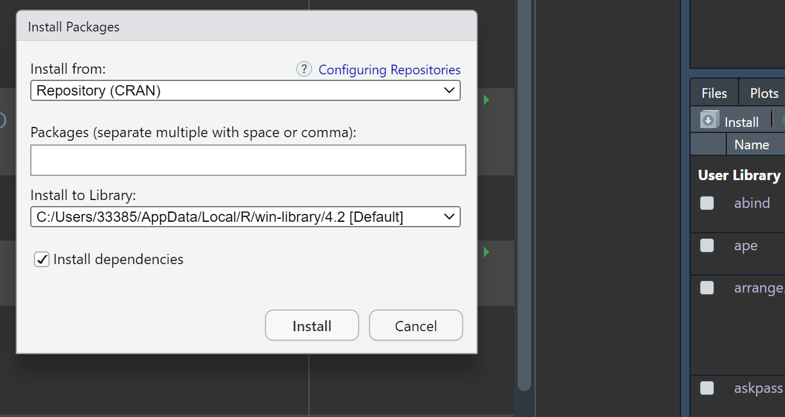

## What is R package
- R files with functions
- Documentation
- Description
- Namespace

## installed with R
- Installed with R **iris,cars**
- CRAN 
- Bioconductor
- R-forge **still in development**
- Github
- Homepage for some tools

## installation
- command line
- GUI installation
- manual installation
- automatic installation **dependencies**

## list the installed
```{r}
p <- installed.packages(.Library, priority = "high")
p
```

## install and update
### from cran
```{r}
install.packages(c("package1", "package2"))
```

CRAN website
- package source: 安装的是源代码，没有编译
- binary: 二进制码，编译好了

from GUI
{width="500"} 
### update
```{r}
update.packages("dplyr")
```

### local
```{r}
installed.packages("~/pacakge.zip", repos = NULL, type = "source")
```
from GUI

form devtools
```{r}
library(devtools)
install_local("~/package.zip")
```

### from bioconductor
#### install bioconductor
```{r}
if (!require("BiocManager", quietly = TRUE))
    install.packages("BiocManager")
BiocManager::install()
```

#### install packages
```{r}
BiocManager::install("RRHO")
# BiocManager::install(c("GenomicFeatures", "AnnotationDbi"))
```

#### View documentation
```{r}
browseVignettes("RRHO")
```

#### update
update all
```{r}
BiocManager::install()
```

update to develop version
```{r}
BiocManager::install(version = "devel")
```

### from R-forge
```{r}
install.packages("cgenpp",repos = c("http://R-Forge.R-project.org", "http://cran.at.r-project.org"), dependencies = TRUE)
```

### from github

